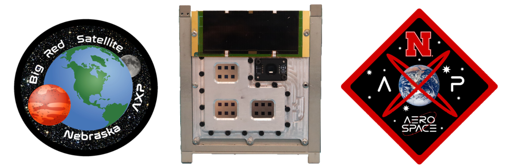

# Big Red Sat

 

Welcome to the Big Red Sat team, we are a multi-disciplinary team of middle school, high school, undergraduate, and graduate students in the Nebraska public school system and the University of Nebraska-Lincoln.  We are a sub-group within the UNL Aerospace Club's Aerospace eXperimental Payloads group that has been working on high altitude balloon launches and a 1U CubeSat, which is currently in-orbit.

This repository contains the original designs for the Big Red Sat-1 1U CubeSat, conceived, designed, and launched by a multi-disciplinary team of middle schoolers and high schoolers from the Nebraska public school system, as well as undergraduate students and graduate students from the University of Nebraska-Lincoln.  

The goal of this scientific mission is to characterize the performance and degradation of experimental perovskite solar cells from the National Renewable Energy Laboratory while in low earth orbit.  To accomplish this, a custom precision curve tracer was designed along with a low-Ohm analog multiplexer that was integrated with Near Space Launch's 1U FastBus CubeSat Platform, which incorporates an electrical power system and Iridium satellite communication system for telemetry.  

Electrical connections to the perovskite solar cell samples were made using pogo-pins, with the temperature of each sample being collected with a high-precision temperature sensor affixed to their back face with EP30-2 epoxy.  The enclosure was designed to be airtight to prevent degradation due to humidity and oxygen, so a pressure and humidity sensor were included to monitor changes in this performance.  Since the final samples had a coverslip epoxied to protect the perovskite layer, the airtight property was considered a redundancy.

Big Red Sat-1 was integrated into the Nanoracks CubeSat Deployer 27 (NRCSD27) on 12 December 2023 and launched on 21 March 2024 on the SpaceX CRS-30 mission.   

Big Red Sat-1 was deployed from NRCSD27 by Voyager Space on 18 April 2024 at 18:05:09 UTC ([Deployment Clip](https://www.youtube.com/clip/UgkxD5o3cp39FE0SL8AzyLTBCwdvlqdmNVEa)).  The satellite made first communication with the operations team at 03:00:10 UTC on 19 April 2024.  The satellite deorbited sometime after 23:41:51 UTC on 1 August 2024 after 105 days of operation.

For our CubeSat designs, visit the [Big Red Sat-1 repository](https://github.com/Big-Red-Sat/Big-Red-Sat-1).

For the different libraries that were modified to make BRS-1 a reality, check out the rest of our [repositories](https://github.com/orgs/Big-Red-Sat/repositories).

## Public Communications

Our Small Satellite Conference 2024 paper, which goes into detail on the technical considerations and designs for the mission, can be [found here](https://digitalcommons.usu.edu/smallsat/2024/all2024/10/).

We presented a webinar to NASA's Small Satellite Community of Practice, which can be found in full [here](https://www.nasa.gov/smallsat-institute/community-of-practice/big-red-sat-1-nebraskas-first-cubesat-experience-and-lessons-learned-for-our-middle-school-to-graduate-school-team/).

## Media

[April 21, 2021 - NASA selects Nebraska students’ satellite to orbit in space](https://news.unl.edu/newsrooms/today/article/nasa-selects-nebraska-students-satellite-to-orbit-in-space/)

[March 6, 2024 - Big Red Sat Team readies for ISS launch](https://news.unl.edu/newsrooms/today/article/big-red-sat-team-readies-for-iss-launch/)

[March 15, 2024 - Young Nebraska scientists built a satellite, it's now headed to space](https://nebraskapublicmedia.org/en/news/news-articles/young-nebraska-scientists-built-a-satellite-its-now-headed-to-space/)

[March 18, 2024 - NASA Set to Launch Four CubeSats to Space Station](https://blogs.nasa.gov/smallsatellites/2024/03/18/nasa-set-to-launch-four-cubesats-to-space-station/)

[March 21, 2024 - Nebraska students launch satellite into space](https://www.1011now.com/2024/03/21/nebraska-students-launch-satellite-into-space/)

[March 25, 2024 - NASA Space X resupply rocket launches Nebraska CubeSat into outer space](https://engineering.unl.edu/news/240325/nasa_cubesat_launch/)

[March 29, 2024 - Satellite launch a success for Nebraska Engineering team](https://news.unl.edu/newsrooms/today/article/satellite-launch-a-success-for-nebraska-engineering-team/)

[April 22, 2024 - Nebraska's first research satellite reaches International Space Station](https://www.hastingstribune.com/news/nebraskas-first-research-satellite-reaches-international-space-station/article_87f0fb4a-ffdd-11ee-b091-f7073b412070.html)
